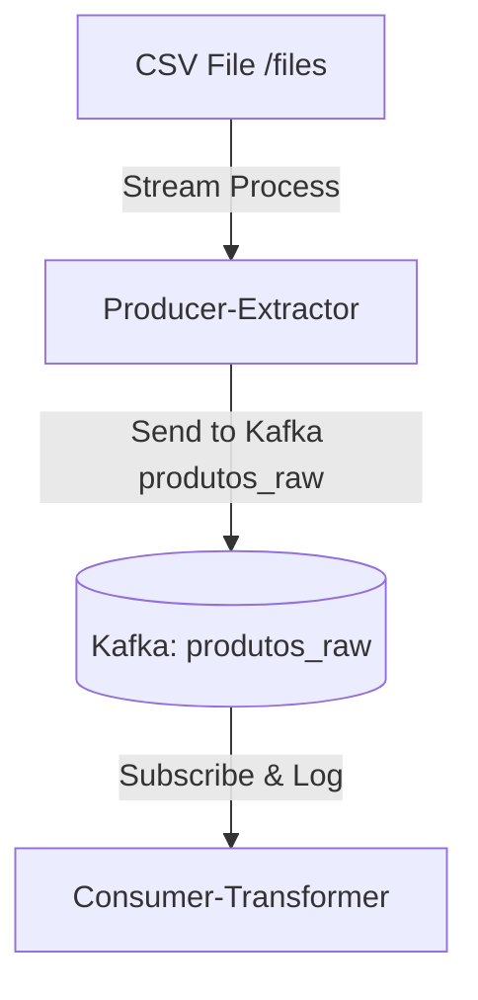

# ETL Simple Monorepo Project with Lerna

## Overview

This monorepo project, named ETL Simple, uses Lerna to manage multiple packages:

producer-extractor: Processes CSV data from /files to Kafka topic produtos_raw.
consumer-transformer: Subscribes to produtos_raw to log data.
Built with NestJS, includes Docker Compose for Kafka, Zookeeper, and Kafka-UI.

## Repository Structure

```
etl-simple/
├── packages/
│   ├── producer-extractor/
│   └── consumer-transformer/
├── docker-compose.yml
├── lerna.json
└── package.json
```

## Getting Started

Prerequisites

- Node.js (v14.x or later)
- Docker
- Docker Compose

## Setup

Clone the repository:

```bash
git clone <repository-url>
cd etl-simple
```

## Install Lerna:

```sh
npm install -g lerna
```

## Bootstrap:

```bash
lerna bootstrap
```

## Running Applications

### Docker Compose

Start services:

```sh
docker-compose up -d
```

- Kafka-UI: http://localhost:8080
- Kafka: `localhost:29092`

## Local Start

_producer-extractor:_

```sh
cd packages/producer-extractor
npm run start:dev
```

_consumer-transformer:_

```sh
cd packages/consumer-transformer
npm run start:dev
```

# Data Flow


