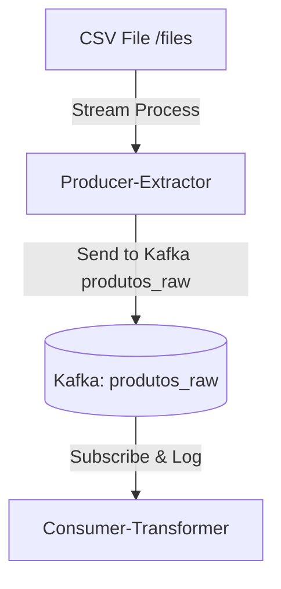

# ETL Simple Monorepo Project with Lerna

## Overview

This monorepo project, named ETL Simple, uses Lerna to manage multiple packages:

producer-extractor: Processes CSV data from /files to Kafka topic produtos_raw.
consumer-transformer: Subscribes to produtos_raw to log data.
Built with NestJS, includes Docker Compose for Kafka, Zookeeper, and Kafka-UI.

## Repository Structure

```
etl-simple/
├── packages/
│   ├── producer-extractor/
│   └── consumer-transformer/
├── docker-compose.yml
├── lerna.json
└── package.json
```

## Getting Started

Prerequisites

- Node.js (v14.x or later)
- Docker
- Docker Compose

## Setup

Clone the repository:

```bash
git clone <repository-url>
cd etl-simple
```

## Install Lerna:

```sh
npm install -g lerna
```

## Running Applications

### Docker Compose

Start services:

```sh
docker-compose up -d
```

- Kafka-UI: http://localhost:8080
- Kafka: `localhost:29092`

### Import this collection in postman

```json
{
    "info": {
        "name": "ksql API",
        "_postman_id": "12345678-abcd-efgh-ijkl-1234567890ab",
        "description": "Coleção para a API do ksql",
        "schema": "https://schema.getpostman.com/json/collection/v2.1.0/collection.json"
    },
    "item": [
        {
            "name": "Create Stream",
            "request": {
                "method": "POST",
                "header": [
                    {
                        "key": "Content-Type",
                        "value": "application/json"
                    }
                ],
                "body": {
                    "mode": "raw",
                    "raw": "{\"ksql\": \"CREATE STREAM produtos (id INT, nome STRING, detalhes STRUCT<categoria STRING, preco DOUBLE>) WITH (KAFKA_TOPIC='produtos_raw', VALUE_FORMAT='JSON');\", \"streamsProperties\": {}}"
                },
                "url": {
                    "raw": "http://0.0.0.0:8088/ksql",
                    "protocol": "http",
                    "host": [
                        "0.0.0.0"
                    ],
                    "port": "8088",
                    "path": [
                        "ksql"
                    ]
                }
            }
        },
        {
            "name": "Query Stream",
            "request": {
                "method": "POST",
                "header": [
                    {
                        "key": "Content-Type",
                        "value": "application/json"
                    }
                ],
                "body": {
                    "mode": "raw",
                    "raw": "{\"ksql\": \"SELECT id, nome, detalhes->categoria AS categoria FROM produtos EMIT CHANGES;\", \"streamsProperties\": {}}"
                },
                "url": {
                    "raw": "http://0.0.0.0:8088/query",
                    "protocol": "http",
                    "host": [
                        "0.0.0.0"
                    ],
                    "port": "8088",
                    "path": [
                        "query"
                    ]
                }
            }
        },
        {
            "name": "ksql",
            "request": {
                "method": "POST",
                "header": [
                    {
                        "key": "Content-Type",
                        "value": "application/json"
                    }
                ],
                "body": {
                    "mode": "raw",
                    "raw": "{\"ksql\": \"SHOW STREAMS;\", \"streamsProperties\": {}}"
                },
                "url": {
                    "raw": "http://0.0.0.0:8088/ksql",
                    "protocol": "http",
                    "host": [
                        "0.0.0.0"
                    ],
                    "port": "8088",
                    "path": [
                        "ksql"
                    ]
                }
            }
        },
        {
            "name": "status",
            "request": {
                "method": "GET",
                "header": [],
                "url": {
                    "raw": "http://0.0.0.0:8088/status",
                    "protocol": "http",
                    "host": [
                        "0.0.0.0"
                    ],
                    "port": "8088",
                    "path": [
                        "status"
                    ]
                }
            }
        }
    ]
}
```

### Then run this queries in /ksql endpoint

```sql
# Primeiro Criar stream de produtos (Modifique para pegar os dados que vc precisa)
CREATE STREAM produtos (system STRING, tenant STRING, data STRUCT<PRODUTO STRING>) WITH (KAFKA_TOPIC='produtos_raw', VALUE_FORMAT='JSON');

# Criar stream de estoque
CREATE STREAM estoque (system STRING, tenant STRING, data STRUCT<PRODUTO STRING, EstoqueGrade STRING>) WITH (KAFKA_TOPIC='estoque_raw', VALUE_FORMAT='JSON');

# Setar o offset Reset
SET 'auto.offset.reset'='earliest';

# Mergear produtos e estoque
CREATE STREAM stocks AS SELECT * FROM estoque p JOIN estoque e WITHIN 1 HOURS ON e.data->PRODUTO = p.data->PRODUTO;

```

## Local Start

_producer-extractor:_

```sh
cd packages/producer-extractor
npm run start:dev
```

_consumer-transformer:_

```sh
cd packages/consumer-transformer
npm run start:dev
```

# Data Flow


